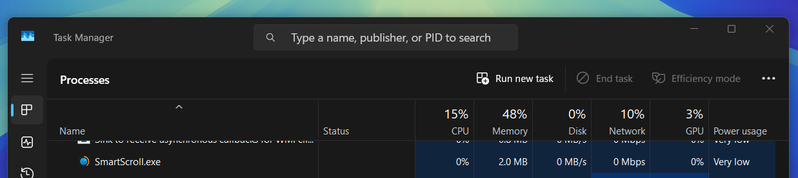

  

<h1 align="center"><strong>Smart Scroll</strong></h1>

<em>Turn your volume knob into a smarter scroll wheel — fluid, customizable, and effortless.</em>

  
  
  

---

## 🧠 What is Smart Scroll?

**Smart Scroll by Aroice** transforms your volume knob or media dial into a powerful scroll wheel.

Seamlessly trigger scrolling based on system states like Mute, Scroll Lock, or Num Lock, making your navigation faster, smarter, and more ergonomic — without needing extra hardware.

- ⚡ **Intuitive scrolling.**
- 🎯 **Zero conflicts.**
- 🎛️ **Perfect for Keyboard with Vol. Knob, control surfaces, and custom keyboards.**

---

## ✨ Core Features

### 🎛️ Customizable Smart Modes:

- **Mute Mode** — Scroll only when system sound is muted.
- **Scroll Lock Mode** — Scroll when Scroll Lock is active.
- **Num Lock Mode** — Scroll when Num Lock is disabled.

### 🖥️ Modern GUI:

- Select and save your preferred mode easily.
- Clean and minimal tray notifications.

### ⚡ Hotkey Shortcuts:

- `WIN + Shift + F1` — Switch Modes instantly.
- `WIN + Shift + F2` — Open Smart Scroll Settings.

### 🚀 Lightweight and Fast:

- Runs silently in the background.
- Minimal CPU and RAM footprint.

### 🚀 Lightweight and Fast:

- Runs silently in the background.
- Minimal CPU and RAM footprint.

  
   
  <em>Smart Scroll using minimal system resources</em>

---

## 🎬 Demo

  

<em>Smart Scroll in action</em>

---

## 📥 Installation

1. **Download** the latest .exe from the [Releases Page](https://github.com/Aryan-Techie/SmartScroll/releases).
2. **Run** `SmartScroll.exe`.  
   *(Alternatively, if you have AutoHotkey installed, you can run SmartScroll.ahk directly.)*
3. **Press `WIN + Shift + F2`** to open the GUI and choose your mode!

**✅ That's it. You're now scrolling smarter!**

---

## 🧩 Ideal For:

- **Developers, writers, and researchers.**
- **Productivity enthusiasts & automation nerds.**
- **Gamers, streamers, and media producers.**
- **Anyone with a volume knob, custom macro pad, or media controller.**

---

## 🛠 How Smart Scroll Works

Smart Scroll hooks into your system's volume change events and monitors:

- 🛑 Whether the system is muted
- 🔃 Whether Scroll Lock is ON
- 🔢 Whether Num Lock is OFF

Based on your chosen mode, it intelligently switches your knob's behavior from volume adjustment to smooth vertical scrolling.

No interference with normal media keys. No accidental triggers.

A purely logical, low-footprint utility built to make your hardware smarter.

---

## 📄 Releases and Changelog

You can find:

- ✅ Latest .exe
- 📑 Changelog
- 🐛 Bug fixes and enhancements

All under the [Releases Section](https://github.com/Aryan-Techie/SmartScroll/releases).

Each version includes:
- Full changelog
- Source code

---

## 🤝 Contributing

Want to make Smart Scroll even smarter?  
We welcome your ideas, feature requests, and improvements!

Steps to contribute:
1. Fork this repository.
2. Create a new branch: `git checkout -b my-feature`.
3. Commit your changes: `git commit -m "Add awesome feature"`.
4. Push to your branch: `git push origin my-feature`.
5. Open a pull request!

**Let's build a better workflow together.** 🔥
---

## 🧭 Roadmap

- [✓] Smart Modes (Mute, Scroll Lock, Num Lock)
- [✓] GUI Interface
- [✓] Hotkey Shortcuts
- [✓] Auto-start with Windows
- [✓] Custom tray icon with quick toggles
- [ ] Per-application behavior
- [ ] Scroll direction toggle
- [ ] Config file for advanced settings
- [ ] Dark mode support

---

## 📜 License

This project is licensed under the MIT License — see the [LICENSE](LICENSE) file for full details.

---
## 💌 Support My Work

If Smart Scroll made your workflow better, consider supporting its development. 
  Your contribution helps keep it free and evolving!

  
  &nbsp;
  

---

## ✍️ Author

Made with ❤️ by **[Aryan Techie](https://aryan.aroice.in)** (aka Aroice)

📩 Connect on Instagram: [@aryantechie](https://instagram.com/aryantechie)

🌐 Explore more: [aroice.in](https://aroice.in)

> *"Technology should empower simplicity — not add complexity."* - [@aroice](https://youtube.com/@aroice)

---

## ❓ Frequently Asked Questions

  

Have questions about Smart Scroll? We've moved our comprehensive FAQ to a dedicated file for better organization.

**Check out the [complete FAQ](./FAQ.md) for answers to common questions about:**
- How Smart Scroll is different from other tools
- Compatibility with various hardware
- Technical performance details
- Configuration options and customization

If you don't find your answer in the FAQ, feel free to [open an issue](https://github.com/Aryan-Techie/SmartScroll/issues) with your question!

---
### 🎛️ Smart Scroll — Enhance Your Workflow & Reimagine Your Volume Knob.
---
